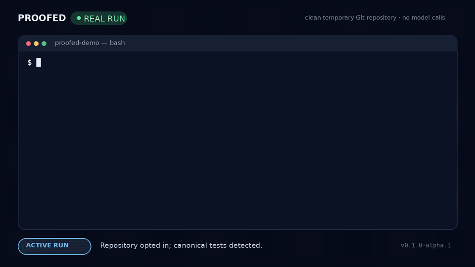

# Proofed

[English](README.md) | [简体中文](README.zh-CN.md)

[](https://github.com/liangfeng-hu/proofed/actions/workflows/ci.yml) [](https://github.com/liangfeng-hu/proofed/releases) [](LICENSE)

### Ask the code—not the agent—whether the work is done.

Coding agents can claim “done” without evidence. Proofed refuses `PASSED` until the **current code** has the evidence your repository requires, then writes a portable completion receipt.

[](assets/proofed-red-green.mp4)

## Add the completion-gate Skill

```bash
npx skills add liangfeng-hu/proofed --skill proofed-verify
```

The Skill works with existing coding agents; it does not replace them. Install the zero-runtime-dependency distribution from PyPI:

```bash
python -m pip install proofed-agent
```

## Watch false completion fail

```console
$ proofed verify
REJECT: missing tests_passed
$ proofed verify --run-tests
PASSED: current code has all required evidence
$ proofed check-receipt RECEIPT --current .
VALID: PASSED receipt matches current subject
```

Change one byte afterward and the old receipt is rejected as `STALE_SUBJECT`. [Run the complete demo](examples/false-completion) in about 30 seconds.

## Why the receipt is different

- **Portable:** Python and JavaScript verifiers can read it without the Proofed kernel, its state database, or a machine-local secret.
- **Current-subject bound:** a code change makes an old receipt stale.
- **CI distrusts committed PASS files:** the Action re-runs configured checks against the current checkout.

## Use it in a repository

```bash
proofed init
proofed run . --intent "finish the current repository task"
proofed status
proofed verify --run-tests
```

`proofed init` is the explicit repository opt-in. It currently detects canonical `pytest`, `unittest`, and `npm test` commands.

Make the same gate a PR check:

```yaml
- uses: liangfeng-hu/proofed@v0.1.0-alpha.3
  with:
    target: .
```

## Go deeper

- [`spec/srr-0.1.md`](spec/srr-0.1.md) — receipt format, subject binding, and L0/L1/L2 trust model
- [`spec/invariants.md`](spec/invariants.md) — normative invariants and exact v0.1 coverage
- [`skills/proofed-verify/SKILL.md`](skills/proofed-verify/SKILL.md) — Agent Skill entry point
- [`CONTRIBUTING.md`](CONTRIBUTING.md) — add a collector, false-completion case, or independent implementation

**Alpha boundary:** Proofed v0.1-alpha enforces evidence-gated completion and stale-subject rejection. It does **not** claim production closure, universal exactly-once effects, an unbypassable host hook, or that passing tests proves correct software. CI is the stronger enforcement surface.
